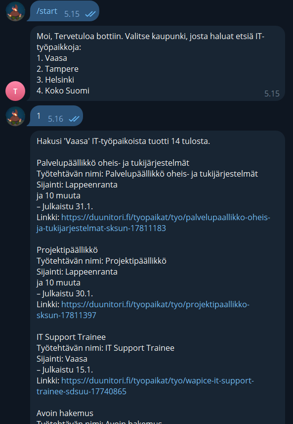

# python-job-finder
UPDATE: 7.2.2024 - PROJECT GOT HUGE UPDATE FROM PYTHON SCRIPT TO THE TELEGRAM BOT !!

webscraping it-jobs and get IT-jobs straight to your phone

Project updates might be:
* Hosting this project for everyone and going public
* Possibility to receive new job offers only
* Possibility to choose how often you want receive messages
* Better scraping and information
* More features to choose like on site

To create your own script, you have to install:

* python

* pip install lxml
* pip install requests
* pip install beautifulsoup4
* pip install beautifulsoup4
* pip install python-telegram-bot
* pip install python-dotenv

and create your own telegram-bot token
